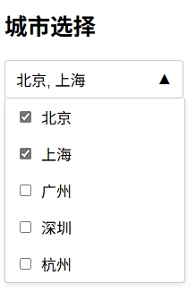

# MultiSelectDropdown 自定义多选控件实现原理

这个 `MultiSelectDropdown` 类是一个自定义的多选下拉框组件，实现了带复选框的多选功能。下面是其关键实现原理：

## 1. 基本架构

组件采用了类的形式封装，通过构造函数接收原始 select 元素的 ID 和配置选项。整个实现基于原生 JavaScript，不依赖任何第三方库。

## 2. DOM 结构替换

- **隐藏原始 select 元素**：保留原始 select 用于数据存储，但在视觉上隐藏
- **创建自定义 DOM 结构**：
  - 容器元素 (container)
  - 头部显示区域 (header)
  - 下拉列表区域 (dropdown)
  - 选项列表 (checkbox items)

## 3. 数据绑定机制

- 组件在初始化时从原始 select 元素中读取选项数据
- 为每个选项创建对应的复选框和标签
- 当用户选择/取消选择时，会同步更新原始 select 元素的选中状态
- 通过 `updateSelection()` 方法实现双向数据绑定

## 4. 事件处理

- **点击头部**：切换下拉列表的显示/隐藏状态
- **点击复选框**：更新选中状态并触发回调
- **点击外部区域**：自动关闭下拉列表

## 5. 状态管理

- 通过 CSS 类 `show` 控制下拉列表的显示/隐藏
- 通过 `▼/▲` 箭头图标指示当前状态
- 选中项在头部区域以逗号分隔的形式显示

## 6. 样式处理

- 设置最大高度限制下拉列表的显示范围
- 使用文本溢出处理（`text-overflow: ellipsis`）确保头部显示区域不会过宽
- 通过 `maxWidth` 选项控制显示宽度

## 7. 回调机制

- 通过 `onChange` 选项提供回调函数接口
- 每次选择变更时触发回调，并传入当前选中的值数组

这个组件的核心优势在于它保留了原始 select 元素的数据结构，同时提供了更灵活的自定义界面和交互体验。它通过原生 DOM 操作和事件处理，实现了一个轻量级但功能完整的多选下拉框组件。
          
# MultiSelectDropdown 使用示例

下面是一个简单的使用例子，展示如何在HTML页面中使用这个自定义多选下拉框组件：

## HTML 部分

```html
<!DOCTYPE html>
<html lang="zh-CN">
<head>
  <meta charset="UTF-8">
  <title>多选下拉框示例</title>
  <style>
    /* 基本样式 */
    .multiselect-container {
      position: relative;
      width: 200px;
      font-family: Arial, sans-serif;
    }
    
    .multiselect-header {
      padding: 8px 12px;
      border: 1px solid #ccc;
      border-radius: 4px;
      background-color: #fff;
      cursor: pointer;
      display: flex;
      justify-content: space-between;
      align-items: center;
    }
    
    .multiselect-dropdown {
      display: none;
      position: absolute;
      width: 100%;
      border: 1px solid #ccc;
      border-top: none;
      border-radius: 0 0 4px 4px;
      background-color: #fff;
      z-index: 1000;
      box-shadow: 0 2px 5px rgba(0,0,0,0.1);
    }
    
    .multiselect-dropdown.show {
      display: block;
    }
    
    .multiselect-item {
      padding: 8px 12px;
      display: flex;
      align-items: center;
    }
    
    .multiselect-item:hover {
      background-color: #f5f5f5;
    }
    
    .multiselect-item label {
      margin-left: 8px;
      cursor: pointer;
    }
  </style>
</head>
<body>
  <h2>城市选择</h2>
  
  <!-- 原始的select元素 -->
  <select id="citySelect" multiple>
    <option value="">请选择城市</option>
    <option value="beijing">北京</option>
    <option value="shanghai">上海</option>
    <option value="guangzhou">广州</option>
    <option value="shenzhen">深圳</option>
    <option value="hangzhou">杭州</option>
  </select>
  
  <!-- 引入多选下拉框组件 -->
  <script src="multiselect.js"></script>
  
  <script>
    // 初始化多选下拉框
    document.addEventListener('DOMContentLoaded', function() {
      // 创建多选下拉框实例
      const cityDropdown = new MultiSelectDropdown('citySelect', {
        placeholder: '请选择城市',
        maxHeight: '150px',
        maxWidth: '180px',
        onChange: function(selectedValues) {
          console.log('选中的城市:', selectedValues);
          // 这里可以添加其他处理逻辑
        }
      });
    });
  </script>
</body>
</html>
```

## 使用步骤说明

1. **创建原始 select 元素**：首先在 HTML 中创建一个带有 `multiple` 属性的 select 元素，包含所有选项

2. **引入组件脚本**：通过 `<script>` 标签引入 `multiselect.js` 文件

3. **初始化组件**：在 DOM 加载完成后，创建 `MultiSelectDropdown` 实例
   ```javascript
   const dropdown = new MultiSelectDropdown('selectElementId', {
     // 配置选项
     placeholder: '请选择',
     maxHeight: '250px',
     maxWidth: '180px',
     onChange: function(selectedValues) {
       // 选择变更时的回调函数
       console.log('选中的值:', selectedValues);
     }
   });
   ```

4. **处理选择变更**：通过 `onChange` 回调函数获取用户选择的值，进行后续处理

5. **运行截图**

   

这个例子展示了如何创建一个城市选择的多选下拉框。当用户选择城市时，选中的值会在控制台输出，你可以根据需要在 `onChange` 回调中添加其他处理逻辑。
        